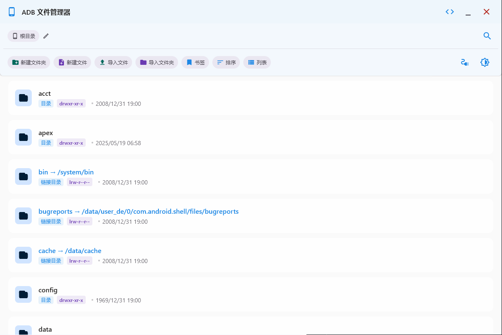
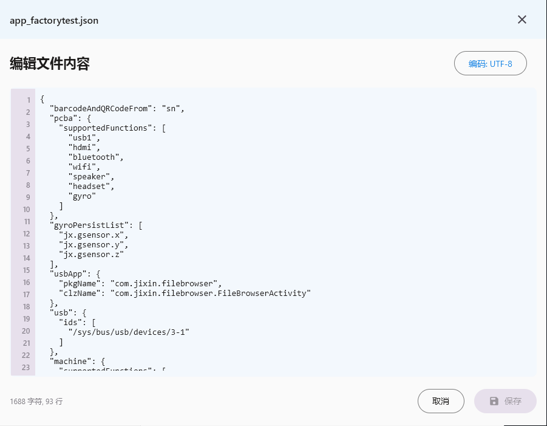
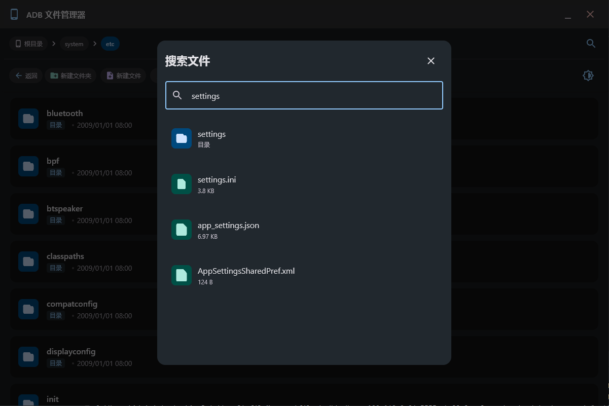

# ADB File Manager

*Read this in [English](README.md) | [中文](README_zh.md)*

A Material You designed Android device file manager that enables remote file operations via ADB connection.


## 📖 Introduction

ADB File Manager is a desktop application that allows you to remotely browse and manage Android device file systems via ADB connection. Built with a modern Material You interface using Jetpack Compose, it offers a smooth user experience and elegant animation effects.

## 📸 Preview

<div align="center">
  
  
  
</div>

## ✨ Features

- 🎨 **Material You Design** - Modern UI design following Google's latest design language
- 📱 **Multi-device Support** - Connect to and manage multiple Android devices
- 📂 **Intuitive File Navigation** - File browser with path navigation bar, supporting path jump by clicking
- 🔍 **Directory Navigation** - Easy directory traversal with breadcrumb navigation, allowing instant jumps to parent directories
- 📝 **File Editing** - Built-in text editor for editing text files on the device
- 🔒 **Permission Check** - Smart detection and prompting for file operation permission issues
- 🔄 **Real-time Feedback** - Real-time status feedback for all operations
- 📥 **File Transfer** - Support for downloading files from and uploading files to devices
- 🌓 **Dark/Light Theme** - Toggle between dark and light themes for comfortable viewing in any environment
- 📄 **File Creation** - Create new text files with custom content directly on the device
- 🔍 **File Search** - Search for files and directories within the current directory
- 🔄 **Advanced Sorting** - Sort files by name, type (folders first or files first), date, and size in ascending or descending order
- 📁 **Folder Import** - Import entire folders from local system to device with a single click
- 🔖 **Bookmarks** - Save frequently accessed directories as bookmarks for quick navigation
- 📊 **Grid View** - Toggle between list and grid view modes for better visual representation of files
- 🖼️ **Drag and Drop File Upload/Download** - Easily upload files by dragging and dropping them into the application, and download files by dragging them out

## 🔧 Technology Stack

- **Kotlin** - Primary development language
- **Jetpack Compose** - Modern UI toolkit
- **ADB** - Android Debug Bridge tool
- **Coroutines** - Handling asynchronous operations
- **Flow** - Reactive data streams

## 🚀 Installation

### Building from Source

1. Clone the repository
   ```bash
   git clone https://github.com/AdbFileManager.git
   cd AdbFileManager
   ```

2. Build with Gradle
   ```bash
   ./gradlew build
   ```

3. Run the application
   ```bash
   ./gradlew run
   ```

## 💡 Usage Instructions

1. **Connect a device**:
   - Ensure USB debugging is enabled on your device
   - Connect the device to your computer
   - Select your device from the dropdown menu

2. **Browse files**:
   - Click on folders to enter them
   - Use the path navigation bar to quickly jump to parent directories
   - Click the refresh button to update the file list

3. **File operations**:
   - Click the menu button next to a file to see available actions
   - Edit: Modify text file content
   - Download: Save the file to your local computer
   - Delete: Remove the file from the device

4. **Create folder**:
   - Click the "New Folder" button in the toolbar
   - Enter a folder name and confirm

5. **Create file**:
   - Click the "New File" button in the toolbar
   - Enter a file name and optional content
   - Confirm to create the file in the current directory

6. **Import files and folders**:
   - Click the "Import File" button to upload a single file
   - Click the "Import Folder" button to upload an entire folder
   - Select the file or folder from your local system
   - The content will be automatically uploaded to the current directory

7. **Toggle theme**:
   - Click the theme icon in the toolbar
   - Select between system default, light theme, or dark theme

8. **Search files**:
   - Click the search icon in the toolbar
   - Enter your search query
   - Results will be displayed in real-time

9. **Sort files**:
   - Click the sort icon in the toolbar
   - Choose from various sorting options:
     - Type (folders first or files first)
     - Name (A-Z or Z-A)
     - Date (oldest or newest)
     - Size (smallest or largest)

## 📋 Upcoming Features

- [ ] File permission modification
- [ ] File preview functionality
- [ ] Multiple files selection for batch operations

## 🤝 Contributing

Contributions, issue reports, and feature suggestions are welcome! See [CONTRIBUTING.md](CONTRIBUTING.md) for details.

1. Fork this repository
2. Create your feature branch (`git checkout -b feature/amazing-feature`)
3. Commit your changes (`git commit -m 'Add some amazing feature'`)
4. Push to the branch (`git push origin feature/amazing-feature`)
5. Submit a Pull Request

## 📄 License

This project is released under the MIT License - see the [LICENSE](LICENSE) file for details.
